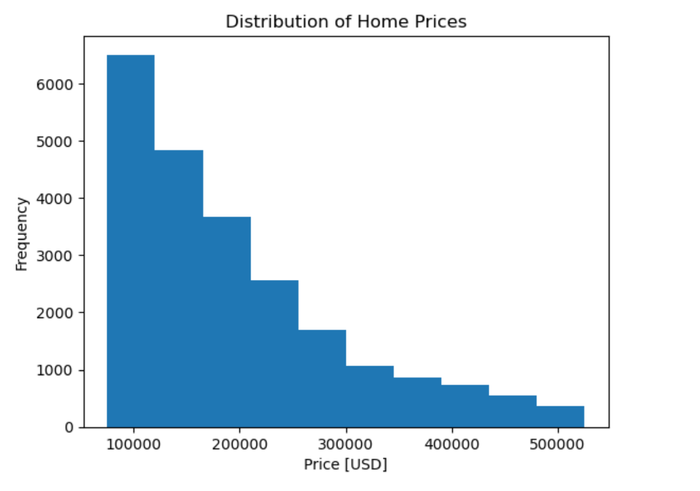
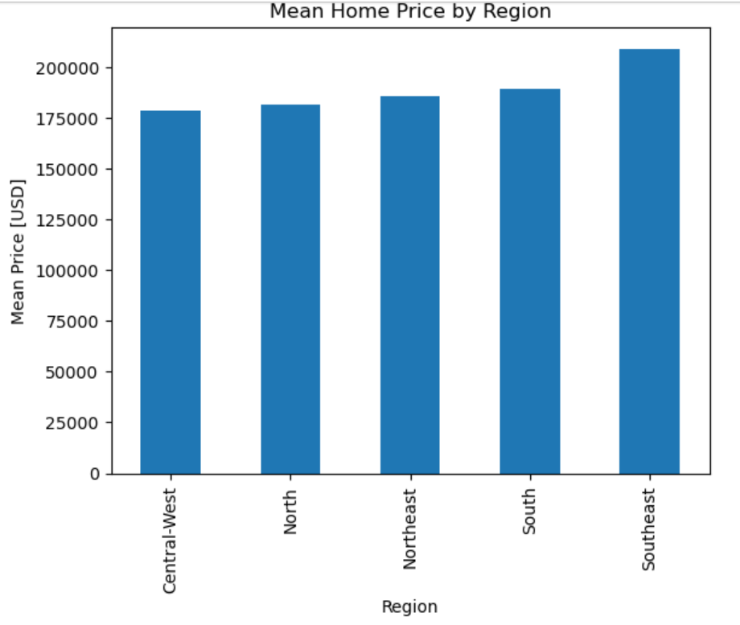
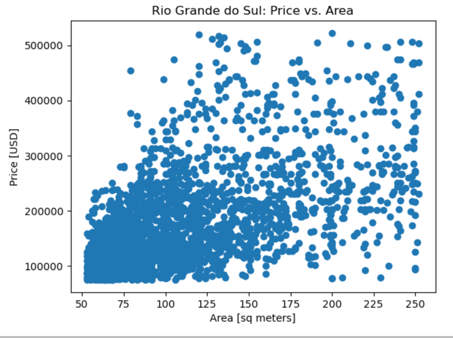

# Housing Analysis in Mexico

Welcome to my project repository for the Applied Data Science Lab at WorldQuant University! In this project, I conducted an analysis of housing trends in Mexico, exploring the impact of various factors such as size and location on real estate prices.

## Project Overview

This project involved:

- Importing and cleansing a dataset of 21,000 properties from a CSV file.
- Exploring the dataset through data visualization techniques.
- Analyzing the relationship between home prices and area.
- Mapping the geographic distribution of properties.

## Key Insights

###              Histogram Distribution of Home Prices

###                 Mean Home Price by Region

###             Scatter Plot Showing Price vs Area

###      Scatter Map_box Showing the Location of Properties

## Skills Developed

- Data exploration and cleaning with Pandas.
- Data visualization techniques including histograms, scatter plots, and map_box visualizations.
- Application of data science to real estate markets.

## Next Steps

I'm looking forward to tackling the next challenge, Project 2 on Apartment Sales in Buenos Aires!

## Ask me 

Feel free to reach out if you have any questions or suggestions for improvement. Thank you for visiting my repository!
