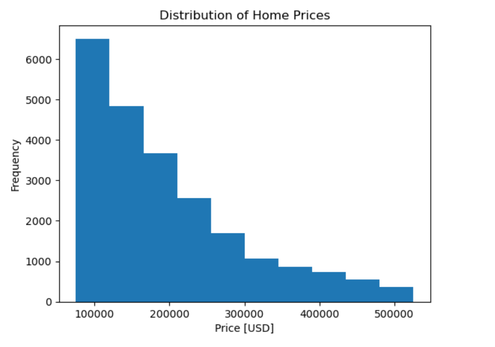
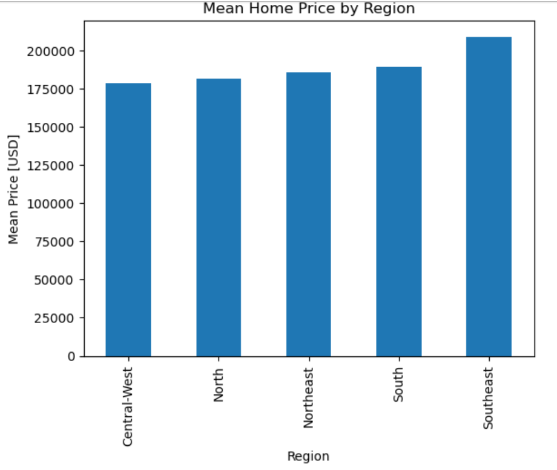
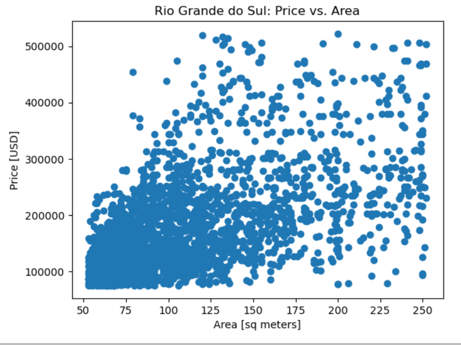
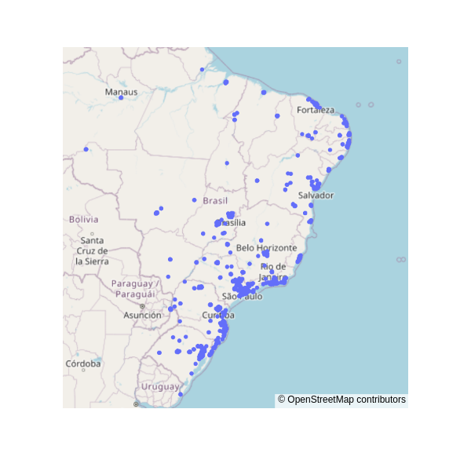

# Housing Analysis in Mexico

Welcome to this project, which involved analyzing a dataset of 21,000 properties to discern the impact of size versus location on real estate prices. I imported and cleansed data from a CSV file, unveiling key insights. Additionally, I explored the dataset through data visualization techniques, analyzed the relationship between home prices and area, and mapped the geographic distribution of properties.

## Project Overview

This project involved:

- Importing and cleansing a dataset of 21,000 properties from a CSV file.
- Exploring the dataset through data visualization techniques.
- Analyzing the relationship between home prices and area.
- Mapping the geographic distribution of properties.

## Key Insights

### hist Plot : Distribution of Home Prices

### Bar Plot : Mean Home Price by Region

### Scatter Plot: Price vs Area

### Scatter Map: Location of Properties

## Skills Developed

- Data exploration and cleaning with Pandas.
- Data visualization techniques including histograms, scatter plots, and map_box visualizations.
- Application of data science to real estate markets.

## Next Steps

I'm looking forward to tackling the next challenge, Project 2 on Apartment Sales in Buenos Aires!

## Ask Me 

Feel free to reach out if you have any questions or suggestions for improvement. Thank you for visiting my repository!
